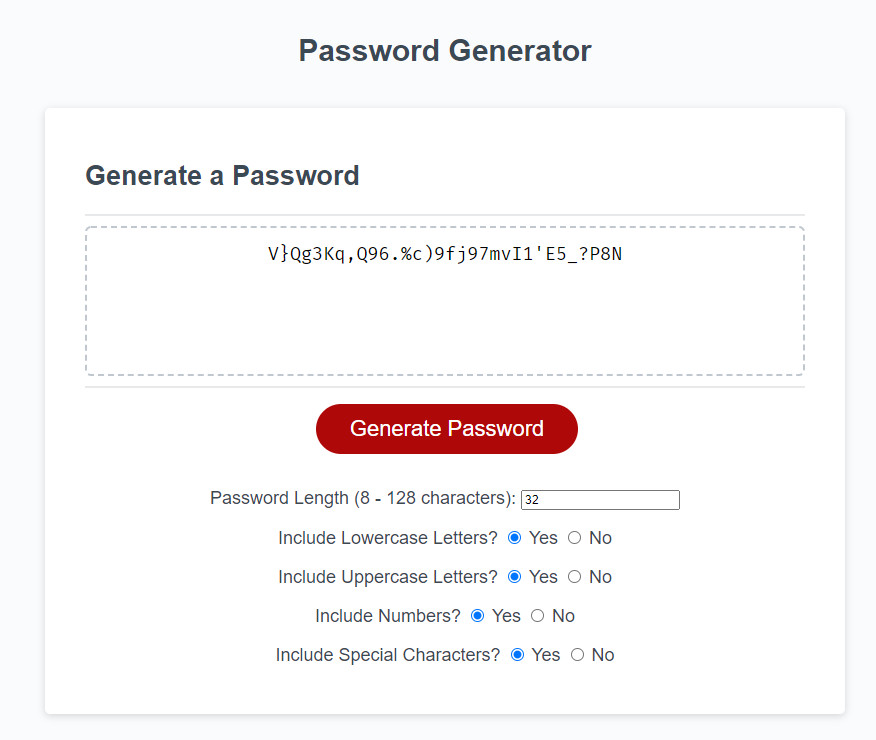

# JavaScript Password Generator
## A small application designed to help you generate secure passwords.
### Assembled with HTML, CSS, and JavaScript.

Created for the University of Toronto's SCS Coding Bootcamp Module 03 Challenge.

Choose a password length and select from the available character sets in order to create a new and secure password for use on any website / account.

This project modifies the base code available at: https://github.com/coding-boot-camp/friendly-parakeet

The extent of its modifications include:
- Adding radio buttons to select which types of characters the user would like to include in the password.
- Adding a number input field to select a valid password length between 8 and 128 characters.
- Modifying the included script.js file to achieve the desired, randomly-generated functionality.

This application does not store any of its generated data. Check for yourself!

### Preview

(I would not recommend using the password in this image, for what it's worth!)
